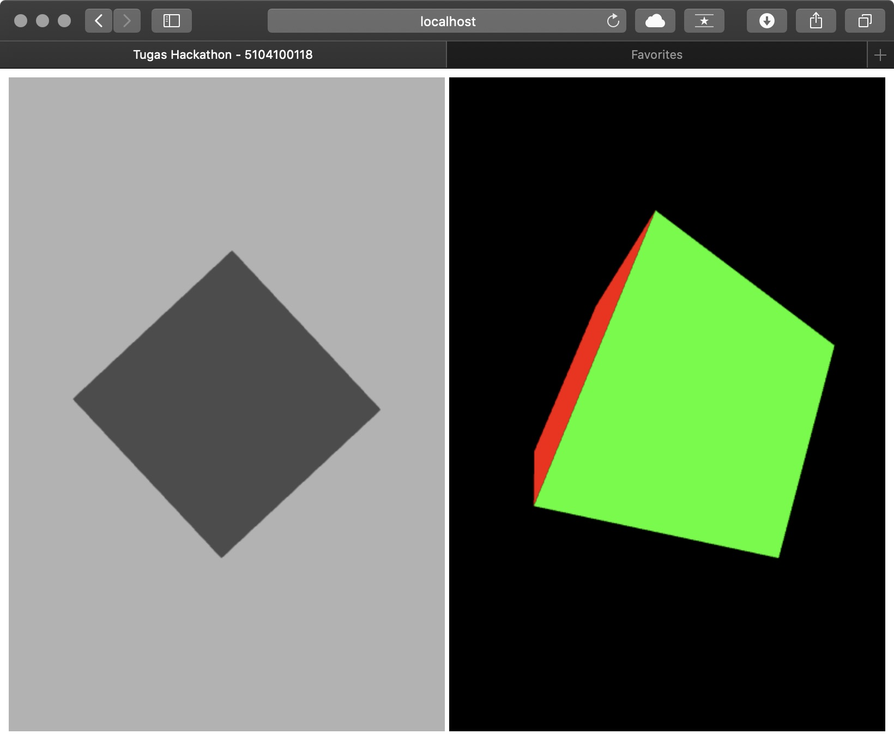
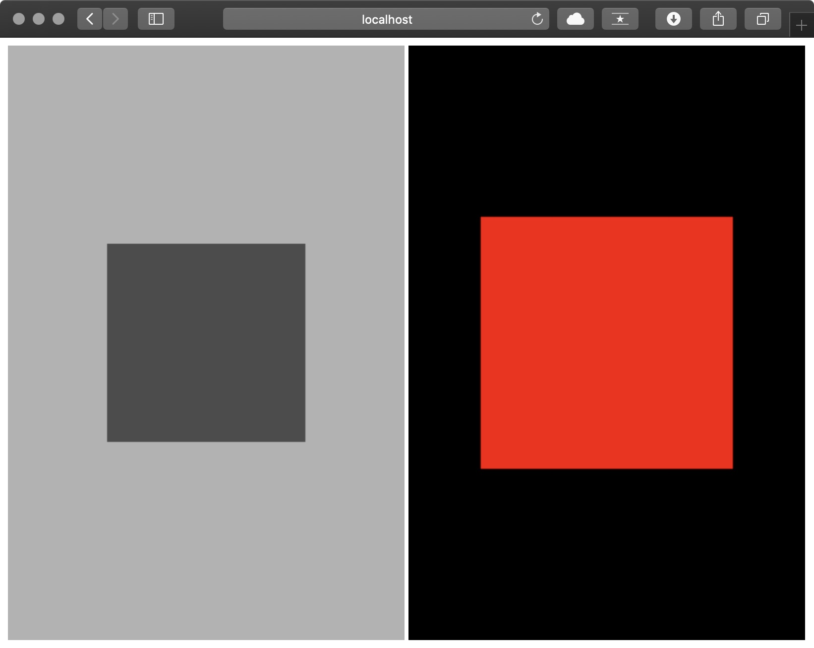
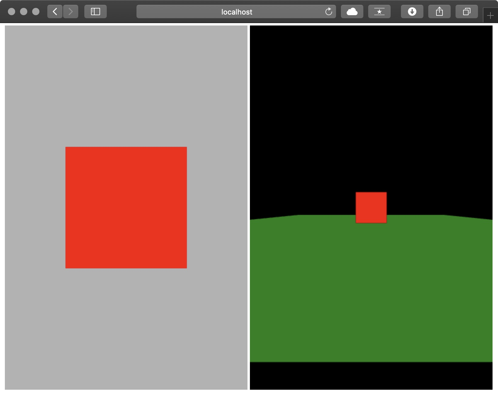

# Hackathon

Anda wajib menggunakan repositori ini sebagai titik mula pengerjaan tugas.
Jangan lupa untuk mengganti nama pada judul halaman HTML yang tersedia dengan NRP Anda.

1. Clone repositori Tugas-1 Anda masing-masing dari Github ke komputer. Repositori ini akan menjadi dasaran pengerjaan Tugas Hackathon ini. Silakan ganti judul halaman HTML dengan "Tugas Hackathon - NRP Anda". Commit dengan pesan "Hackathon #1", lalu Push repositori Anda ke Github.
2. Hentikan animasi rotasi pada kedua kanvas. Commit dengan pesan "Hackathon #2", lalu Push repositori Anda ke Github.
3. Tambahkan sebuah bidang datar bewarna #xyzxyz seluas 10x10 unit pada kedua kanvas, dengan xyz adalah tiga digit terakhir NRP Anda. Bidang ini diposisikan sedemikian rupa sehingga dia menjadi alas dari obyek utama yang Anda punya. Commit dengan pesan "Hackathon #3", lalu Push repositori Anda ke Github.
4. Implementasikan pencahayaan Ambient dengan nilai 0.2 untuk semua warna. Commit dengan pesan "Hackathon #4", lalu Push repositori Anda ke Github.
5. Implementasikan pencahayaan Diffuse warna putih dengan asumsi sumber cahaya sangat jauh seperti cahaya matahari (directional ray bukan point light). Simulasikan cahaya (matahari) ini seolah mengitari obyek, terbit dari kanan kanvas, tenggelam di kiri kanvas, sehingga tampak seperti simulasi siang-malam. Commit dengan pesan "Hackathon #5", lalu Push repositori Anda ke Github.
6. Buatlah animasi kamera untuk kanvas sebelah kanan, dimana kamera ini menyimulasikan first person view. Bila ditekan tombol depan (up arrow key), maka kamera akan berjalan maju. Bila ditekan tombol belakang (down arrow key) kamera akan berjalan mundur. Bila ditekan tombol kanan (right arrow key) kamera akan berputar ke kanan (menengok ke kanan). Bila ditekan tombol kiri (left arrow key) kamera akan berputar ke kiri (menengok ke kiri). Commit dengan pesan "Hackathon #6", lalu Push repositori Anda ke Github.

## Hackathon #1

Mengganti judul halaman HTML menjadi "Tugas Hackathon - 5104100118";

## Hackathon #2

Menghentikan animasi rotasi pada kedua kanvas dengan memodifikasi definisi attribute, uniform, dan baris code pada shader terkait;

## Hackathon #3

Menambah sebuah bidang datar (alas obyek) bewarna #118118, yakni r: 17, g: 129, b: 24 pada skala 0-255, atau r: 0.06666666667 g:0.5058823529 b:0.09411764706 pada skala 0-1); Warna kotak pada frame sebelah kiri yang awalnya abu-abu sekalian saya ubah jadi merah supaya identik dengan warna kotak pada frame sebelah kanan; Baik frame sebelah kiri maupun kanan telah saya atur agar sama-sama memiliki bidang datar (alas obyek), hanya saja tidak terlihat pada frame sebelah kiri, karena tidak ada perspektif. Kamera pada frame sebelah kanan saya letakkan di posisi -5.5;

